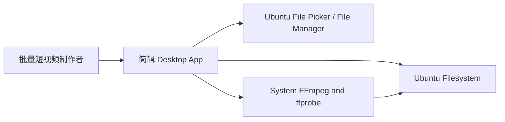
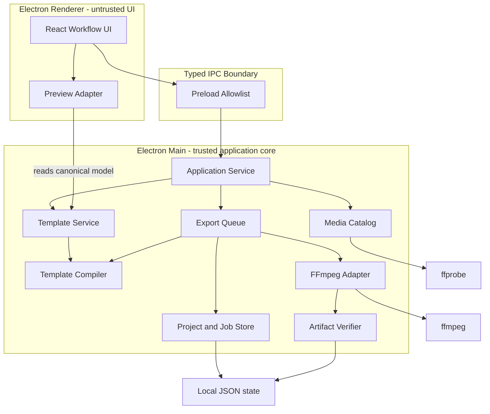
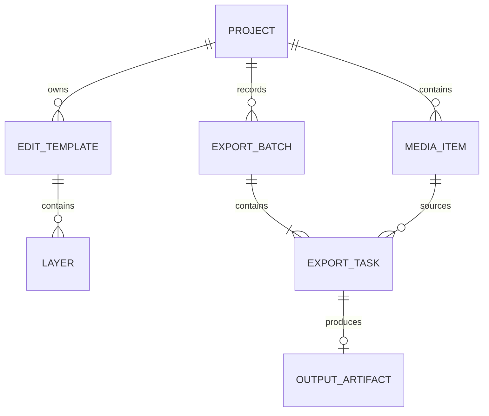

# Architecture: 简辑

简辑采用单机桌面 monolith：Electron main process 是文件、子进程、持久化和导出生命周期的唯一 owner，React renderer 只负责交互与近似预览，FFmpeg 是最终媒体渲染的唯一 owner。系统以 versioned canonical 编辑模板连接预览和导出，并以持久化串行队列、临时文件和结果探测保证批处理可恢复且不覆盖原始素材。

## System Overview

### Architecture Style

选择单机桌面 monolith，而非客户端/服务端或微服务架构。所有组件在用户 Ubuntu 主机上运行，但用 Electron process boundary 分离 UI 与受信任的文件/进程能力；内部模块按 domain responsibility 划分，避免把 UI、命令编译和任务状态混为一体。

### System Context Diagram



## Component Architecture

### Component Diagram



### Component Descriptions

| Component | Responsibility | Technology | Dependencies |
|-----------|----------------|------------|--------------|
| Workflow UI | 三步主流程、素材列表、图层属性、队列和结果展示 | React + TypeScript | Preload Allowlist, Preview Adapter |
| Preview Adapter | 把 canonical 编辑模板映射为 DOM/Canvas 近似预览 | TypeScript | Browser video, canonical model |
| Preload Allowlist | 暴露最小、typed、可校验的 IPC API | Electron preload | Main IPC handlers |
| Application Service | 编排用例，执行路径和状态授权 | TypeScript | Domain services |
| Media Catalog | 管理 `MediaItem`，探测与重新验证原始素材 | TypeScript | ffprobe adapter |
| Template Service | 校验、版本化、保存和加载编辑模板 | TypeScript + JSON Schema | Project Store |
| Template Compiler | 从模板快照和媒体元数据生成安全 FFmpeg argv | Pure TypeScript | Filter registry, font resolver |
| Export Queue | 导出任务状态机、串行调度、取消和重试 | TypeScript | Job Store, FFmpeg Adapter |
| Project and Job Store | 原子写入项目、模板、导出批次和任务状态 | Versioned JSON + fsync/rename | Ubuntu filesystem |
| FFmpeg Adapter | 只以 argv 启动和控制 ffmpeg/ffprobe 子进程 | Node child_process, shell=false | System binaries |
| Artifact Verifier | 探测临时输出并创建 `OutputArtifact` | ffprobe | Job Store, filesystem |

## Technology Stack

### Core Technologies

| Layer | Technology | Version Policy | Rationale |
|-------|------------|----------------|-----------|
| Desktop shell | Electron | 实现时锁定一个仍受支持的 stable major | 原生文件对话框、子进程、Ubuntu 打包和 Chromium 视频预览成熟 |
| Frontend | React + TypeScript | 锁定 exact versions | 适合图层状态、列表和 typed IPC；团队生态成熟 |
| Core runtime | Electron main / Node.js | 随所选 Electron 固定 | 同一语言实现 domain model、队列和安全子进程适配 |
| Persistence | Versioned JSON + atomic replace | Internal schema v1 | 单用户、最多百级任务，无需数据库和迁移框架 |
| Media engine | System FFmpeg/ffprobe | 最低兼容版本在 Spike 后冻结 | 最终渲染能力完整，避免维护第二套媒体实现 |
| Packaging | AppImage and `.deb` | CI pinned | 覆盖 Ubuntu 常见安装方式；FFmpeg 独立探测 |

### Key Libraries & Frameworks

| Library | Purpose | License Consideration |
|---------|---------|-----------------------|
| Electron | 桌面 runtime | MIT |
| React | UI | MIT |
| Zod or JSON Schema validator | IPC 和持久化 schema 校验 | 选择 MIT 许可实现 |
| FFmpeg | probe、filter graph、编码 | 发行前必须核对实际 build 的 LGPL/GPL 与 codec 许可 |

生产依赖 MUST 使用 lockfile 固定并由自动化安全更新流程维护；本规格不把未来易漂移的 exact version 写死。

## Architecture Decision Records

| ADR | Title | Status | Key Choice |
|-----|-------|--------|------------|
| [ADR-001](ADR-001-local-desktop-and-ffmpeg.md) | 本地桌面与 FFmpeg 边界 | Accepted | Electron monolith + system FFmpeg，媒体不出本机 |
| [ADR-002](ADR-002-canonical-template-model.md) | Canonical 编辑模板与归一化布局 | Accepted | 一个 versioned scene model 驱动预览与导出 |
| [ADR-003](ADR-003-durable-export-queue.md) | 持久化串行导出队列 | Accepted | 原子 JSON state + temp output + ffprobe verify |

## Data Architecture

### Data Model



Field-level constraints are canonical in [Requirements: Data Entities](../requirements/_index.md#data-entities). Architecture adds these ownership rules:

- `EditTemplate` is mutable only in editor state; `ExportBatch.templateSnapshot` is immutable.
- `ExportBatch.status` is derived from child `ExportTask.status` and MUST NOT become a second state owner.
- `OutputArtifact` exists only after Artifact Verifier succeeds.
- `MediaItem.sourcePath` and layer asset paths are references; project files do not own or delete referenced user files.

### Data Storage Strategy

| Data Type | Storage | Retention | Backup |
|-----------|---------|-----------|--------|
| Project | User-selected `.jianji-project.json` | Until user deletes | Atomic replace + `.bak` previous valid version |
| Reusable template | User-selected `.jianji-template.json` | Until user deletes | Schema version and optional portable resource manifest |
| Queue state | App data `jobs/{batchId}.json` | User-cleared or 30 days after completion | Atomic replace + startup validation |
| Logs | App data rotating JSONL | 14 days or 50MB | No remote upload |
| Temporary output | Output directory hidden partial file | Until completion/cancel cleanup/recovery | Never treated as output成片 |
| Output成片 | User-selected output directory | User-managed | Application does not delete automatically |

## IPC Design

Renderer MUST NOT receive raw Node or filesystem access. Preload exposes only these validated use cases:

| Channel | Direction | Purpose | Result |
|---------|-----------|---------|--------|
| `media.selectAndProbe` | Renderer → Main | 选择并探测原始素材 | `MediaItem[]` with per-file errors |
| `template.save/load` | Renderer → Main | 保存或加载编辑模板 | Validated `EditTemplate` |
| `project.save/load` | Renderer → Main | 持久化项目 | Validated `Project` |
| `proof.render` | Renderer → Main | 创建验证样片 | `ExportTask.id` |
| `export.create/cancel/retry` | Renderer → Main | 控制导出批次 | Validated task summaries |
| `export.subscribe` | Main → Renderer | 推送队列状态快照 | Monotonic revisioned state |
| `artifact.open/reveal` | Renderer → Main | 播放或定位已验证结果 | Success/error |

所有 request/response MUST 通过 runtime schema 校验；未知字段默认拒绝。IPC MUST NOT 提供任意命令执行或任意路径删除能力。

## Security Architecture

### Security Controls

| Control | Implementation | Requirement |
|---------|---------------|-------------|
| Process isolation | `contextIsolation=true`, `nodeIntegration=false`, sandboxed renderer | NFR-S-001 |
| IPC authorization | Preload allowlist + request/response schema + path scope validation | NFR-S-001 |
| Command safety | `spawn(binary, argv, {shell:false})`; filter values由 compiler 转义或使用受控文件 | NFR-S-001 |
| Source protection | 输入路径只读；输出路径相交检查；无删除原始素材 API | REQ-001, REQ-004 |
| Output integrity | same-filesystem temp file、fsync、ffprobe、atomic rename | REQ-004, NFR-R-001 |
| Network privacy | 无媒体上传、无必需网络 endpoint、默认无 telemetry | NFR-S-001 |

## Infrastructure & Deployment

### Deployment Architecture

首版通过 Ubuntu AppImage 和 `.deb` 分发。应用启动时执行 capability check：Electron renderer、可写 app data、`ffmpeg`、`ffprobe`、`drawtext`/overlay/filter 支持、H.264 encoder、AAC encoder 和字体解析；任何 Must capability 缺失时进入 blocked setup screen，而非让首次导出才失败。

### Environment Strategy

| Environment | Purpose | Configuration |
|-------------|---------|---------------|
| Development | 本地开发和 golden sample | Pinned Node package manager, fixture FFmpeg |
| CI | unit、integration、headless E2E 和 package smoke | Ubuntu supported baseline container/VM |
| Release candidate | 真实 Ubuntu 桌面与多 GPU/CPU smoke | AppImage + `.deb`, system FFmpeg matrix |
| Production | 用户本机 | Offline-first, system capability detection |

## Quality Attributes

| Attribute | Target | Measurement | ADR Reference |
|-----------|--------|-------------|---------------|
| Performance | 100 条素材下 UI 常用操作 P95 < 200ms | Chromium trace + queue fixtures | ADR-001, ADR-003 |
| Reliability | 进程 kill 后零已完成记录丢失、零 partial 假成功 | Fault-injection E2E | ADR-003 |
| Safety | 原始素材哈希前后一致，零 shell injection | Hash matrix + hostile filename tests | ADR-001 |
| Fidelity | 归一化图层边界与 golden output 容差内一致 | Frame extraction + layout assertions | ADR-002 |
| Usability | 5 分钟内启动首个 2 条视频批次 | Moderated first-run test | UI contract |

## State Machine

### ExportTask Lifecycle

```text
                         validation/resource error
  create()      ┌────────────┐ ───────────────────────┐
┌────────┐      │ VALIDATING │                        ▼
│ QUEUED │ ───▶ └─────┬──────┘                  ┌────────┐
└───┬────┘            │ valid                   │ FAILED │
    │ cancel()         ▼                         └───┬────┘
    │             ┌─────────┐  process error         │ retry()
    │             │ RUNNING │ ───────────────────────┤
    │             └──┬───┬──┘                        ▼
    │      cancel()  │   │ exit 0               ┌────────┐
    │                │   ▼                      │ QUEUED │
    │                │ ┌───────────┐            └────────┘
    │                │ │ VERIFYING │ ── invalid ──▶ FAILED
    │                │ └─────┬─────┘
    │                ▼       │ valid
    │          ┌────────────┐ ▼
    └────────▶ │ CANCELLED  │ ┌───────────┐
               └────────────┘ │ COMPLETED │
                              └───────────┘

On startup: VALIDATING | RUNNING | VERIFYING | CANCELLING -> INTERRUPTED
INTERRUPTED --retry()--> QUEUED
INTERRUPTED --dismiss()--> CANCELLED
```

| From State | Event | To State | Side Effects | Error Handling |
|------------|-------|----------|--------------|----------------|
| `queued` | scheduler picks | `validating` | persist revision; validate paths/resources/capability | permanent validation error → `failed` |
| `validating` | valid | `running` | create temp path; spawn FFmpeg; persist PID metadata | spawn error → `failed` |
| `running` | progress | `running` | throttle and persist progress; notify UI | malformed progress logs warning, process remains owner |
| `running` | process exit 0 | `verifying` | close handles; run ffprobe | invalid output → `failed` |
| `verifying` | valid artifact | `completed` | atomic rename; create OutputArtifact | rename error → `failed`, temp retained for diagnosis |
| `queued` | cancel | `cancelled` | persist terminal state | none |
| `running` | cancel | `cancelling` | SIGINT, bounded wait, then SIGKILL | cleanup partial; terminal `cancelled` |
| non-terminal | app restart | `interrupted` | preserve evidence and partial marker | user MAY retry or dismiss |
| `failed/interrupted` | retry | `queued` | new attempt and temp filename | old attempt retained |

`ExportBatch.status` MUST be derived: any non-terminal child → `active`; all completed → `completed`; otherwise all terminal → `completed_with_errors` or `cancelled` according to child summary.

## Configuration Model

### Required Configuration

| Field | Type | Default | Constraint | Description |
|-------|------|---------|------------|-------------|
| `ffmpegPath` | absolute path | discovered from `PATH` | executable and capability checked | 最终渲染 binary |
| `ffprobePath` | absolute path | discovered from `PATH` | executable and version-compatible | 媒体与结果探测 binary |
| `outputDirectory` | absolute directory | last valid selection | exists or creatable; writable; not source file path | 当前导出目录 |
| `exportPreset` | enum object | `source/balanced/source-fps` | matches `ExportPreset` schema | 输出参数 |

### Optional Configuration

| Field | Type | Default | Constraint | Description |
|-------|------|---------|------------|-------------|
| `queueConcurrency` | integer | `1` | MVP fixed to 1; future range 1–2 | 同时编码数 |
| `filenameSuffix` | string | `_edited` | max 40 chars; filesystem-safe | 输出名称后缀 |
| `conflictPolicy` | enum | `increment` | `increment` only in MVP | 重名时追加序号 |
| `logRetentionDays` | integer | `14` | 1–90 | 本地结构化日志保留 |
| `previewProxyEnabled` | boolean | `true` | boolean | 对难解码素材生成低清预览代理，不影响最终输出 |
| `cancelGraceSeconds` | integer | `10` | 2–30 | SIGINT 后强制结束等待 |

配置存入 app data，不使用 secret。环境变量仅用于开发/测试覆盖：

| Variable | Maps To | Required |
|----------|---------|----------|
| `JIANJI_FFMPEG_PATH` | `ffmpegPath` | No |
| `JIANJI_FFPROBE_PATH` | `ffprobePath` | No |
| `JIANJI_LOG_LEVEL` | log level | No |

## Error Handling

### Error Classification

| Category | Severity | Retry | Examples |
|----------|----------|-------|----------|
| Input permanent | Item-level | No until user changes input | 无视频轨道、贴纸缺失、字体不可解析 |
| Environment permanent | Batch-blocking | No until setup fixed | FFmpeg/encoder 缺失、输出目录无权限 |
| Resource transient | Item or batch | Yes after user action | 磁盘空间不足、文件暂时被占用 |
| Process failure | Item-level | Yes | FFmpeg non-zero exit、意外终止 |
| User cancellation | Expected terminal | User MAY retry | 用户取消 queued/running task |
| Recovery | Item-level | Yes | 上次运行遗留的 `interrupted` task |

### Per-Component Error Strategy

| Component | Error Scenario | Behavior | Recovery |
|-----------|----------------|----------|----------|
| Media Catalog | 单个输入探测失败 | MUST 返回 per-item error；MUST NOT 丢弃其他有效输入 | 替换文件或重新探测 |
| Template Service | schema/资源无效 | MUST 保留原文档并拒绝 export-ready | 修复引用或使用兼容迁移 |
| Template Compiler | 无法安全表达参数 | MUST fail closed；MUST NOT 降级忽略图层 | 指明 layer id 和字段 |
| Export Queue | 单任务失败 | MUST 持久化 `failed` 并继续队列 | 仅重试失败项 |
| FFmpeg Adapter | 子进程卡住或取消 | MUST 发 SIGINT，超时后 MAY SIGKILL | 标记取消/失败并清理 partial |
| Artifact Verifier | 输出不可探测 | MUST 标记失败；MUST NOT publish | 保留日志，重试生成 |
| Project Store | 原子写入失败 | MUST 保留最近有效文件和内存 dirty state | 另存或恢复 `.bak` |

UI 错误 MUST 显示用户可理解的原因、受影响对象和下一步；原始 FFmpeg stderr 只放入可展开详情和本地日志。

## Observability

### Metrics

| Metric Name | Type | Labels | Description |
|-------------|------|--------|-------------|
| `media_probe_total` | counter | `result`, `container` | 素材探测结果 |
| `export_task_total` | counter | `terminal_status`, `error_code`, `preset` | 任务终态分布 |
| `export_duration_seconds` | histogram | `resolution`, `encoder` | 单项导出耗时 |
| `export_realtime_factor` | histogram | `resolution`, `encoder` | 输出时长/编码时长 |
| `queue_depth` | gauge | `status` | 各状态任务数量 |
| `ui_action_duration_ms` | histogram | `action` | 本地 UI 核心操作耗时 |

以上指标默认仅写入本地诊断聚合，MUST NOT 自动上传。

### Logging

| Event | Level | Required Fields | Description |
|-------|-------|-----------------|-------------|
| `capability_check` | INFO/ERROR | `ffmpeg_version`, `features`, `result` | 启动能力检查 |
| `media_probed` | INFO/WARN | `media_id`, `result`, `error_code` | 不记录完整用户路径，使用 id 和 basename |
| `export_transition` | INFO | `batch_id`, `task_id`, `from`, `to`, `attempt`, `revision` | 状态机转换 |
| `export_failed` | ERROR | `task_id`, `stage`, `error_code`, `stderr_tail` | stderr 限长并移除敏感绝对路径 |
| `project_recovery` | WARN | `project_id`, `source`, `result` | 备份或中断恢复 |

### Health Checks

| Check | Trigger | Failure Action |
|-------|---------|----------------|
| FFmpeg capability | 应用启动、binary path 变更 | 阻止导出，显示安装/选择 binary 指引 |
| Output directory | 创建导出批次前 | 阻止启动并允许重新选择 |
| Required resources | 验证样片及批量导出前 | 列出缺失素材、字体、贴纸 |
| Free disk estimate | 创建批次前及每项开始前 | 阻止新任务；运行中失败时保留证据 |
| Queue consistency | 启动恢复时 | 损坏记录隔离并使用最近有效备份 |

## Graceful Shutdown

1. Main process MUST 停止接受新的验证样片和导出批次。
2. MUST 原子持久化当前 queue revision 和 UI dirty state。
3. 若有 running task，默认提示“等待完成”或“安全停止并退出”；无交互的 OS shutdown 走安全停止。
4. 安全停止向 FFmpeg 发送 SIGINT，最多等待 `cancelGraceSeconds`，必要时 SIGKILL。
5. 未完成任务 MUST 写为 `interrupted`，partial file MUST 保持非最终命名。
6. 所有文件 handle 和 IPC subscription 关闭后才退出 main process。

## Trust & Safety

| Level | Description | Approval Required | Allowed Operations |
|-------|-------------|-------------------|--------------------|
| High Trust | 已验证的 app data 与任务状态 | None | 读写内部 state、追加日志 |
| Standard | 用户通过 native dialog 选择的源/目标路径 | Initial explicit selection | 读取原始素材；在输出目录创建新文件 |
| Low Trust | 项目/模板中的路径、文件名、媒体元数据和 FFmpeg stderr | Re-validation every use | 仅在 schema、scope 和 capability 校验后使用 |

## Implementation Guidance

### Key Decisions for Implementers

| Decision | Options | Recommendation | Rationale |
|----------|---------|----------------|-----------|
| UI runtime | Electron / PySide / hosted web | Electron | 文件与子进程能力成熟，同时保留现代图层 UI |
| Final renderer | FFmpeg / browser canvas / dual engine | FFmpeg only | 单一输出 owner，codec/filter 支持成熟 |
| Queue persistence | JSON / SQLite / in-memory | Atomic versioned JSON | 单用户百级任务足够，依赖与迁移更少 |
| Layout unit | pixels / per-ratio templates / normalized | normalized display-frame coordinates | 同一模板适配横竖屏和不同分辨率 |
| FFmpeg distribution | system / bundled / remote | system capability detection for MVP | 降低包体和许可复杂度；安装体验风险明确可测 |

### Implementation Order

1. Domain schemas + fixture/golden contract：先固定 normalized layout、状态机和版本迁移。
2. Media probe + safe filesystem primitives：建立原始素材只读与 atomic output 边界。
3. Template Compiler + FFmpeg Adapter：用合成 fixture 证明文字、贴纸、滤镜和 hostile filenames。
4. Durable Export Queue + recovery：在 UI 前完成 fault-injection。
5. Preload IPC + Workflow UI + Preview Adapter：把已验证核心能力暴露给用户。
6. Package/capability UX + real Ubuntu smoke：验证 AppImage、`.deb` 和 system FFmpeg matrix。

### Testing Strategy

| Layer | Scope | Tools | Coverage Target |
|-------|-------|-------|-----------------|
| Unit | schema、坐标变换、命名、状态机、filter escaping | Vitest | 所有 domain branches；状态转换 100% |
| Integration | ffprobe、Template Compiler、FFmpeg Adapter、atomic store | Vitest + real FFmpeg fixtures | 每个 Must codec/container path 与故障类 |
| Golden media | 横/竖屏、Unicode、透明贴纸、字体、滤镜强度 | FFmpeg frame extraction + image assertions | 每个 layer/filter adapter 至少一例 |
| Desktop E2E | 导入→编辑→样片→整批→重启恢复 | Playwright Electron | 全部 Must acceptance paths |
| Manual Ubuntu | 文件对话框、播放器、文件管理器、打包安装 | Supported Ubuntu matrix | AppImage 和 `.deb` release gate |

## Risks & Mitigations

| Risk | Impact | Probability | Mitigation |
|------|--------|-------------|------------|
| System FFmpeg 版本/encoder 不一致 | High | High | 启动 capability check；冻结最低 matrix；清晰 setup UX |
| 浏览器预览与 FFmpeg 色彩/字体差异 | High | Medium | canonical model、golden tests、验证样片硬边界 |
| 4K 素材使预览或编码占满资源 | Medium | High | preview proxy、串行队列、UI/worker isolation |
| 字体或贴纸在之后被移动 | Medium | Medium | fingerprint + export readiness validation |
| JSON state 在掉电时损坏 | High | Low | temp + fsync + atomic rename + previous valid backup |
| Electron 权限面过大 | High | Medium | sandbox renderer、typed preload allowlist、路径 scope |
| FFmpeg 发行许可处理不当 | High | Medium | MVP system dependency；发行前 legal/license checklist |

## Open Questions

- [ ] 支持的 Ubuntu 最低版本和桌面环境矩阵是什么？
- [ ] system FFmpeg 安装体验是否可接受，还是发行版必须捆绑经过许可审核的 binary？
- [ ] preview proxy 是否要在 MVP 默认自动生成，还是只在解码失败时启用？
- [ ] 首版硬件编码是否需要进入 capability registry？

## References

- Derived from: [Requirements](../requirements/_index.md), [Product Brief](../product-brief.md)
- Next: [Epics & Stories](../epics/_index.md)
