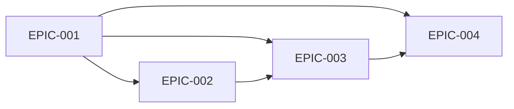

# Epics & Stories: 简辑

MVP 被拆为四个按能力收敛的 Epic：先建立安全的素材与项目基础，再完成 canonical 编辑模板和验证样片，随后接入持久化导出队列，最后闭合结果检查与故障恢复。四个 Epic 都属于 MVP，因为缺少任一项都会破坏“反复批量编辑并可靠拿到视频”的完整用户结果。

## Epic Overview

| Epic ID | Title | Priority | MVP | Stories | Est. Size |
|---------|-------|----------|-----|---------|-----------|
| [EPIC-001](EPIC-001-media-and-project-foundation.md) | 素材与项目基础 | Must | Yes | 4 | L |
| [EPIC-002](EPIC-002-template-and-preview.md) | 编辑模板与验证样片 | Must | Yes | 4 | L |
| [EPIC-003](EPIC-003-export-pipeline.md) | 安全批量导出管线 | Must | Yes | 4 | L |
| [EPIC-004](EPIC-004-results-and-resilience.md) | 结果与恢复 | Must | Yes | 3 | M |

## Dependency Map

### Dependency Notes

- EPIC-001 固定 domain schema、安全文件边界和项目 store，是其余能力的基础。
- EPIC-002 必须先稳定 canonical 编辑模板与真实验证样片，EPIC-003 才能批量复用相同 compiler。
- EPIC-004 复用 EPIC-001 的持久化机制和 EPIC-003 的状态机、结果验证与错误分类。

### Recommended Execution Order

1. [EPIC-001](EPIC-001-media-and-project-foundation.md)：先锁定数据、路径安全和持久化 contract。
2. [EPIC-002](EPIC-002-template-and-preview.md)：用单条验证样片证明模板表达和最终渲染。
3. [EPIC-003](EPIC-003-export-pipeline.md)：把已验证的单条 renderer 扩展为持久化批次。
4. [EPIC-004](EPIC-004-results-and-resilience.md)：补齐结果消费、故障注入和重启恢复。

## MVP Scope

### MVP Epics

- EPIC-001：批量输入和可恢复项目状态。
- EPIC-002：多文字/贴纸、单全局滤镜、近似预览和验证样片。
- EPIC-003：每个输入独立、安全、串行导出。
- EPIC-004：逐项结果、失败隔离、取消、重试和 interrupted recovery。

### MVP Definition of Done

- [ ] 在受支持 Ubuntu 环境，用户可离线完成“导入 → 编辑模板 → 验证样片 → 批量导出 → 打开结果”。
- [ ] 横屏与竖屏合成 fixtures 使用同一编辑模板，文字、贴纸和滤镜均出现在符合 normalized layout contract 的位置。
- [ ] 至少 20 条混合素材批次可完成，单项坏文件不阻断其他有效输出。
- [ ] 编码中强制终止应用后，重启可保留完成项并把非终态任务准确标为 `interrupted`。
- [ ] 所有原始素材哈希前后一致；同名与恶意文件名测试无覆盖、无 shell injection。
- [ ] AppImage 与 `.deb` 至少各在一套受支持 Ubuntu 环境通过安装和核心路径 smoke test。

## Traceability Matrix

| Requirement | Epic | Stories | Architecture |
|-------------|------|---------|--------------|
| REQ-001 | EPIC-001 | STORY-001-001, 001-002 | ADR-001 |
| REQ-002 | EPIC-002 | STORY-002-001, 002-002, 002-003 | ADR-002 |
| REQ-003 | EPIC-002 | STORY-002-003, 002-004 | ADR-001, ADR-002 |
| REQ-004 | EPIC-003 | STORY-003-001..004 | ADR-001, ADR-003 |
| REQ-005 | EPIC-004 | STORY-004-001..003 | ADR-003 |
| REQ-006 | EPIC-001, EPIC-004 | STORY-001-003, 001-004, 004-003 | ADR-002, ADR-003 |
| NFR-P-001 | EPIC-002, EPIC-003 | STORY-002-003, 003-003 | ADR-001, ADR-003 |
| NFR-R-001 | EPIC-003, EPIC-004 | STORY-003-004, 004-003 | ADR-003 |
| NFR-S-001 | EPIC-001, EPIC-003 | STORY-001-002, 003-001, 003-002 | ADR-001 |
| NFR-U-001 | EPIC-002, EPIC-004 | STORY-002-001, 004-001 | Workflow UI |

## Estimation Summary

| Size | Meaning | Count |
|------|---------|-------|
| S | Small - well-understood, minimal risk | 2 |
| M | Medium - some complexity, moderate risk | 11 |
| L | Large - significant complexity, should consider splitting | 2 |
| XL | Extra Large - must split before implementation | 0 |

Epic size only表示整体范围；所有 implementation Story 均不超过 L，进入计划时 SHOULD 继续拆成可独立验证的任务。

## Risks & Considerations

| Risk | Affected Epics | Mitigation |
|------|----------------|------------|
| system FFmpeg capability 漂移 | EPIC-001, EPIC-002, EPIC-003 | 先实现 startup capability registry 和真实 fixture matrix |
| 预览与成片语义漂移 | EPIC-002, EPIC-003 | canonical model + shared compiler + golden media + 验证样片 |
| 队列恢复只在 happy path 工作 | EPIC-003, EPIC-004 | 在实现 UI polish 前完成 kill、disk-full、permission fault injection |
| Epic 以 UI 完成为假收敛 | All | 每个 Epic 的 DoD 以 domain/FFmpeg executable evidence 为准 |

## Versioning & Changelog

### Version Strategy

- **Versioning Scheme**: Application 使用 SemVer；project/template schema 使用独立单调整数。
- **Breaking Change Definition**: 旧项目或模板无法无损加载、导出语义改变、任务状态语义改变均属于 breaking change。
- **Deprecation Policy**: 至少支持前一个 schema major 的显式迁移；未知 future schema fail closed。

### Changelog

| Version | Date | Type | Description |
|---------|------|------|-------------|
| 0.1.0-spec | 2026-09-11 | Added | 初始 Ubuntu MVP specification |

## Open Questions

- [ ] 是否把 system FFmpeg 安装引导作为 EPIC-001 的一部分，还是发布工程中的独立 blocking task？
- [ ] 是否要在 EPIC-003 的 MVP 中加入硬件编码 spike？

## References

- Derived from: [Requirements](../requirements/_index.md), [Architecture](../architecture/_index.md)
- Handoff to: implementation planning after open questions are resolved or accepted as assumptions
