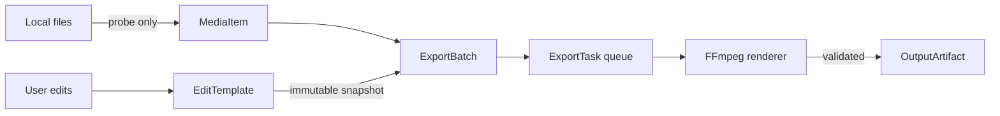

# Requirements: 简辑

本 PRD 将“批量导入 → 创建编辑模板 → 验证样片 → 批量导出 → 检查结果”定义为 MVP 完整闭环。所有 Must 要求均保护原始素材，并要求每条导出任务独立、可追踪、可恢复。

## Requirement Summary

| Priority | Count | Coverage |
|----------|-------|----------|
| Must Have | 6 | 素材、模板、预览、导出、结果和持久化闭环 |
| Should Have | 0 | 首版不把重要可靠性能力推迟到 Should |
| Could Have | 0 | 增强项记录在 Open Questions，不进入 MVP |
| Won't Have | 5 类 | 时间线、音频编辑、云端、跨平台、合并成片 |

## Functional Requirements

| ID | Title | Priority | Traces To |
|----|-------|----------|-----------|
| [REQ-001](REQ-001-batch-media-import.md) | 批量导入与检查原始素材 | Must | G-001, G-003 |
| [REQ-002](REQ-002-reusable-edit-template.md) | 创建并复用编辑模板 | Must | G-001, G-005 |
| [REQ-003](REQ-003-preview-and-proof-render.md) | 预览并生成验证样片 | Must | G-004, G-005 |
| [REQ-004](REQ-004-batch-export-queue.md) | 创建并执行批量导出队列 | Must | G-001, G-002, G-003 |
| [REQ-005](REQ-005-result-and-recovery.md) | 检查结果并恢复失败任务 | Must | G-002, G-003 |
| [REQ-006](REQ-006-project-persistence.md) | 保存并恢复项目状态 | Must | G-001, G-002 |

## Non-Functional Requirements

### Performance

| ID | Title | Target |
|----|-------|--------|
| [NFR-P-001](NFR-P-001-interaction-and-export-performance.md) | 交互与导出性能 | 100 条素材下常用 UI 操作 P95 < 200ms |

### Reliability

| ID | Title | Target |
|----|-------|--------|
| [NFR-R-001](NFR-R-001-crash-safe-recovery.md) | 崩溃安全与恢复 | 已完成结果不丢失；运行中任务可判定并重试 |

### Security

| ID | Title | Standard |
|----|-------|----------|
| [NFR-S-001](NFR-S-001-local-data-safety.md) | 本地数据与文件安全 | 离线完成核心流程；零原位覆盖 |

### Usability

| ID | Title | Target |
|----|-------|--------|
| [NFR-U-001](NFR-U-001-first-run-usability.md) | 首次使用可完成性 | 5 分钟内启动首个两条视频批次，不含编码 |

## Behavioral Constraints

- 应用 MUST 把原始素材视为只读输入。
- 编辑模板 MUST 在创建导出批次时冻结为不可变快照；批次启动后的 UI 编辑 MUST NOT 改变正在执行的导出任务。
- 每条导出任务 MUST 单独进入终态；一个任务失败 MUST NOT 自动取消其他任务。
- 输出写入 MUST 使用临时文件，编码和校验成功后才 MAY 原子移动为最终文件名。
- 应用 MUST NOT 静默覆盖既有文件；命名冲突 MUST 产生新文件名或要求用户明确选择。
- 交互预览 MUST 标记为近似预览；只有验证样片和输出成片 MAY 被描述为最终渲染结果。

## Data Requirements

### Data Entities

| Entity | Key Fields | Constraints & Relations |
|--------|------------|-------------------------|
| `Project` | `id: UUID`, `schemaVersion: integer`, `name: string`, `mediaItems: MediaItem[]`, `activeTemplateId: UUID`, `updatedAt: datetime` | `schemaVersion` MUST 支持显式迁移；引用一个活动编辑模板 |
| `MediaItem` | `id: UUID`, `sourcePath: absolute path`, `displayName: string`, `fingerprint: string`, `durationMs: integer`, `width: integer`, `height: integer`, `rotation: enum`, `probeStatus: enum` | `sourcePath` 只读；`fingerprint` 用于检测文件变化；属于一个素材批次 |
| `EditTemplate` | `id: UUID`, `name: string`, `version: integer`, `layers: Layer[]`, `filter: FilterConfig`, `createdAt`, `updatedAt` | `layers` 按 `zIndex` 合成；保存时版本递增 |
| `TextLayer` | `id: UUID`, `type: text`, `content: string`, `fontFamily: string`, `fontSizeRatio: number`, `color: RGBA`, `x/y/width: 0..1`, `opacity: 0..1`, `zIndex: integer`, `visible: boolean` | 内容最长 500 字符；完整时长显示；布局基于自动旋转后的画面 |
| `StickerLayer` | `id: UUID`, `type: sticker`, `assetPath: absolute path`, `assetFingerprint: string`, `x/y/width: 0..1`, `rotationDeg: number`, `opacity: 0..1`, `zIndex: integer`, `visible: boolean` | 支持 PNG/JPEG/WebP；缺失资源时模板不可进入导出就绪状态 |
| `FilterConfig` | `presetId: enum`, `intensity: 0..1` | 一个编辑模板最多一个全局滤镜；`none` 表示无滤镜 |
| `ExportPreset` | `container: mp4`, `videoCodec: h264`, `audioCodec: aac`, `resolutionMode: source|1080p|720p`, `frameRateMode: source|30`, `quality: high|balanced|small` | MVP 的容器与 codec 固定；分辨率不得拉伸宽高比 |
| `ExportBatch` | `id: UUID`, `templateSnapshot: EditTemplate`, `mediaIds: UUID[]`, `outputDirectory: path`, `preset: ExportPreset`, `status: enum`, `createdAt`, `finishedAt?` | 与多个导出任务一对多；模板快照不可变 |
| `ExportTask` | `id: UUID`, `batchId: UUID`, `mediaId: UUID`, `status: enum`, `progress: 0..1`, `attempt: integer`, `outputPath?`, `errorCode?`, `errorMessage?` | 状态转换遵守 Architecture 中的状态机；每次重试增加 `attempt` |
| `OutputArtifact` | `taskId: UUID`, `path: absolute path`, `sizeBytes: integer`, `durationMs: integer`, `createdAt: datetime` | 只有完成校验后创建；与导出任务一对一 |

### Data Flows

项目数据只保存路径、指纹、模板参数和任务状态；MUST NOT 把原始视频内容复制进项目文件。

## Integration Requirements

| System | Direction | Protocol | Data Format | Notes |
|--------|-----------|----------|-------------|-------|
| Ubuntu 文件系统 | Both | Native filesystem API | Files/paths | 选择输入、模板资源与输出目录 |
| `ffprobe` | Outbound | Child process | JSON | 获取视频轨道、时长、画面尺寸、旋转信息 |
| `ffmpeg` | Outbound | Child process | argv + progress stream | 唯一最终渲染引擎；禁止 shell 字符串拼接 |
| Ubuntu 文件管理器 | Outbound | Desktop portal / OS command | Directory path | 打开输出目录 |
| 系统字体目录 | Inbound | Font discovery | Font file | 文字图层导出前必须解析到确定字体文件 |

## Constraints & Assumptions

### Constraints

- MVP 仅面向 Ubuntu，所有媒体处理在本机执行。
- 输入支持 MP4、MOV、MKV、WebM；实际 codec 支持能力由 `ffprobe`/`ffmpeg` 探测结果决定。
- 输出统一为 H.264/AAC MP4，且每个原始素材分别生成一个输出成片。
- MVP 不提供时间线；所有可见图层和全局滤镜覆盖视频完整时长。
- 同一个素材批次只应用一个编辑模板快照。

### Assumptions

- 初始性能与交互验证按最多 100 条素材、单条不超过 4K/60fps 设计。
- CPU 编码是基线；硬件编码在需求确认前不属于 MVP。
- 自动旋转后的显示画面是归一化坐标的基准。
- 字体与贴纸资源可能在项目关闭后被移动，因此每次导出前必须重新验证。

## Priority Rationale

所有 6 个功能要求共同构成用户所描述的最小闭环。将队列恢复、验证样片或项目持久化降为 Should 会让“反复简单剪辑导出”在真实长时任务中不可依赖，因此它们均列为 Must；时间线和云能力明确排除。

## Traceability Matrix

| Goal | Requirements |
|------|-------------|
| G-001 | REQ-001, REQ-002, REQ-004, REQ-006 |
| G-002 | REQ-004, REQ-005, REQ-006, NFR-R-001 |
| G-003 | REQ-001, REQ-004, REQ-005, NFR-S-001 |
| G-004 | REQ-003, NFR-U-001 |
| G-005 | REQ-002, REQ-003, NFR-P-001 |

## Open Questions

- [ ] 100 条是否足够覆盖典型最大批次？
- [ ] MVP 是否需要硬件编码；若需要，目标优先级是 NVIDIA NVENC 还是 VAAPI？
- [ ] 文字图层是否必须支持用户导入字体文件，还是系统字体选择已足够？

## References

- Derived from: [Product Brief](../product-brief.md)
- Next: [Architecture](../architecture/_index.md)
