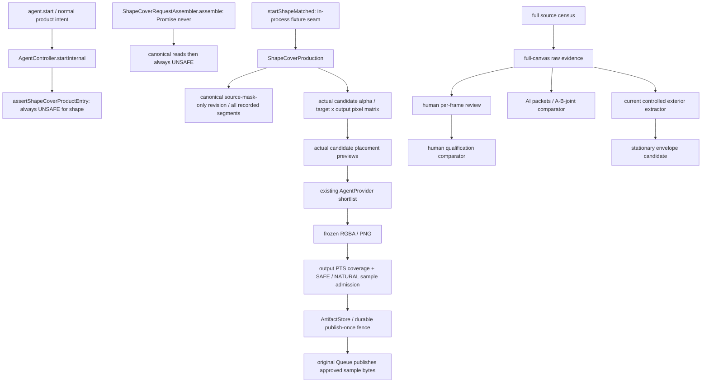

# Shape-Matched Cover V1 Course Correction Audit

## M2 Qualification Boundary Course Correction — 2026-10-02

本节是 M1-A → M2-E 实施后的追加审计；下方首次 course-correction 的判断与证据保持历史解释。用户指定基线 `2e4274b09ea8d21e7eae3ea700b74844a229d0c1` 的实际 diff 为 10 个文件、1295 行新增：inventory、registry、blind truth 工具、controls 和四份文档，没有修改产品源码。开始实际 HEAD 为 `582f8f6`，其后千川提交与 Shape 算法无关；审计期间另有项目规则提交 `2581291`，按当前规则执行。未运行新 holdout triage、真实媒体实验或 M3。

**结论：M2-E 工具本身值得保留，但把其完整真人资格协议升级为默认 V1 static 的唯一验收门发生了第二次 scope drift。** 三个独立真实来源具有多样性验证价值；“never-exposed + 双盲独立真人 + 压缩视频逐像素 truth”是更强的实验协议，不能仅因工具存在就成为所有 M2 工程工作的 blocker。取消该默认依赖不等于当前 mask 已完整，也不把旧失败改成通过。

### Source and Call-Path Evidence

| Owner | Current implementation | Boundary judgment |
| --- | --- | --- |
| `source-fact-discovery-evidence.ts` / `shape-cover-stationary-discovery.ts` | 最多96精确原帧，CPU统计、全部components、原像素ROI复核；无ROI/mask预填 | M1-A真实自动发现已成立；候选不签身份、mask或全片absence。 |
| `source-mask-static-target.ts` / `source-mask-static-extraction.ts` | 显式身份/范围确认、完整ROI流式绑定；temporal support及3px外扩；RGB样本包络超24拒绝 | M2-A有保守开发候选；判据不核查support之外的完整边界，不能因3px外扩自动合格。 |
| `shape-cover-static-anomalies.py` / `shape-cover-static-geometry.py` | 重放133异常；独立持久梯度landmarks全范围核查 | M2-B不能把RGB异常直接解释为运动；M2-C支持声明灵敏度内geometry，不证明mask外缘或低alpha贡献完整。 |
| `source-mask-static-qualification.ts::qualifyStaticMask` / `shape-cover-required-pixel-truth.py::compare` | 已知构造truth可比较；真实/缺truth保持INCOMPLETE或null | 独立pixel comparator有效；准确miss/excess需要独立分母，不需要把任何可操作工程评估都伪装为这个强声明。 |
| `shape-cover-static-holdout.py::Registry.freeze_truth/accept_actual_evidence/compare` | 两个人类声明、真实身份核实、冻结truth及candidate pin；调用者为truth脚本/tests | 是离线强真值协议，没有生产consumer；保留原拒绝与SOURCE_QUALIFIED解释，不增加默认产品依赖。 |
| `shape-cover-production.ts` / `shape-cover-activation.ts` / assembler | 生产消费canonical admitted masks、共同矩阵、freeze/admission/custody；guard/assembler固定拒绝 | 不读取M2-E registry/reviewer/holdout资格。未来目标proof仍有真实接线缺口，本轮不开放或绕过。 |

CodeGraph已核对 `qualifyStaticMask`、`Registry.freeze_truth`、`Registry.compare` 的caller/callee；跨语言边界和未显示关系由imports及精确caller搜索核实，未把“图中没有边”单独当无依赖证明。

### Evidence Levels

| Level | Required evidence | Claim and stop |
| --- | --- | --- |
| Product runtime | 非空确认集合、源/范围/方法绑定、保守mask与完整目标时域核查；每输出实际alpha255全覆盖；SAFE/NATURAL、冻结同字节、原queue/custody | 确认集合内全部安全覆盖；不证明未检出目标不存在。缺证据UNSAFE，产品仍关闭。 |
| Default offline engineering | 独立已知truth的受控正反例；真实development全范围geometry与边界风险检查；明确方法、支持包络、取消/失配/超限拒绝；多来源真实批量验证在M5收敛 | 只声明对应工程检查通过及已检查范围的边界观察；不能填无分母的pixel指标或宣称全片真实零漏。 |
| Optional research / high assurance | 未曝光且可核查独立来源、candidate-blind人工truth、双人QA、freeze/no-adaptive-tuning与comparator | 原M2-E最多ZERO_MISS_ON_FROZEN_TRUTH_SET；协议不完整仍HOLDOUT_INSUFFICIENT/SOURCE_INCOMPLETE，不传播成默认M2唯一blocker。 |

仅凭压缩后的RGB不能唯一恢复原贴纸alpha、抗锯齿或编码串色来源；两名真人也不能制造不可观测真值。默认验收需要可解释的保守包含依据：原始alpha/已知构造提供精确分母；真实源使用原像素与候选边界配对核查、完整目标范围异常证据及明确支持包络。无法被有限安全余量包含的边界歧义仍拒绝；不允许用geometry、算法自身mask、一个较大bbox或主观“看起来一样”填补。

### Disposition and Current Stop

- **KEEP**：M1发现、M2-A开发mask、M2-B/C异常与geometry、M2-D comparator、M2-E inventory/registry/truth工具及全部失败/receipts。
- **SIMPLIFY**：默认M2验收改为 [Delta Spec §6](shape-matched-cover-v1-simplification-spec.md#6-conservative-mask-contract) 的工程检查与限定声明；至少3个独立真实来源保留为M5批量验收下限，开发/验收使用情况如实记录，不强制全部never-exposed。
- **RESEARCH_ONLY**：双人blind pixel-truth资格、严格unseen holdout来源协议及其更强比较声明；自愿使用时原协议不放宽。
- **DEPRECATE_FROM_V1_PATH**：将HOLDOUT_INSUFFICIENT/valid reviewers=0自动当作默认M2所有工程工作或M3研究代码的永久技术依赖；不删除任何guard或赋予新authority。

当前M2仍INCOMPLETE：3395px mask尚缺按新边界完成的真实边界工程评估；M2-A RGB拒绝与M2-C geometry职责分离尚未形成新的可消费目标proof；canonical knowledge/admission接线也未完成。唯一后续候选slice是**以既有development材料收敛static mask边界与异常解释的工程验收**，不是新holdout triage或M3。本轮只修订合同、计划与记录，不执行该slice，不将旧SOURCE_QUALIFIED/null结果迁移成新PASS。

### Independent Investigation and Parent Decision

受管Kimi deep只读调查6个合同/实现文件，invocation `d7f6f116-f79f-4634-a0a5-2d788caa7064`，seal `84f65c846ae0b509c91b6c59941f2d26d12926b41e229281240487dd1a8fcd90`，qualified route `4f2d5dc8-4234-4665-b382-e82f1ad6cc00`；4 wire requests、199.786s、PARSED、无orchestration retry。Parent核对canonical receipt、4个artifact SHA及7项完整observed reads，封存期间未改任何frozen文件。初次inspect因instruction precedence缺CLAUDE.md而零请求拒绝，修正后新seal正常执行，preflight原因保留。

接受其三项源码判断：运行时不消费M2-E资格；旧Spec确实已把三重门槛写成默认资格条件；风险采样不等于全片逐帧pixel truth。**不采用其“沿用旧B方案就是唯一可行纠偏”的建议**：它回答了现有合同要求什么，没有提供两位真人/严格unseen数为何对当前V1风险必需的技术证据。其封存包未含M2-B/C、M2-D comparator实现及历史record，这些source audit由Parent补齐。当前任务明确要求重新判断这些新增要求，任务内合同修订由Parent完成scope/self-review，不额外请求批准，也不静默放宽工具的原SOURCE_QUALIFIED含义。研究审计不是final implementation review、真人truth或验收authority。

## Decision and Scope

2026-10-02，`SOURCE_AUDITED / DOCUMENTATION_ONLY / PRODUCT_DISABLED`。结论：**默认发布路线确实发生 scope drift；confirmed-target-only 是自洽且更贴近本轮产品目标的合同。** 不应继续以 D2Q→D3→D4→FullSourceAdmissionHandle 为 V1 主线。保留像素、冻结、画面安全与托管基础，优先补真实 CPU detector 和保守 mask。

本审计从 `f0b678ed987664dbebae4ddf2493236ab311aa97` 开始。期间最新 HEAD 为 `be854ff3f55afc93a13f0c6edd9540fae8b3732b`，只新增千川浏览器诊断文档；两者产品源码相同。本轮只新增本文、[Delta Spec](shape-matched-cover-v1-simplification-spec.md)、[Revised Plan](shape-matched-cover-v1-simplification-plan.md)。不删除代码或历史、不改算法/guard、不执行资格或模型联调。

依据为当前 AGENTS、V1/auto-contour Spec 与 Plan、M4/M5-B/C/D/D1/D2/D2Q 和 [AI record](shape-matched-cover-m5d2a.md)、[Stationary record](shape-matched-cover-stationary-record.md)，并核对实际 imports/callers、CodeGraph、源码与本机历史证据。CodeGraph 的通用短成员关联存在误配，关键 receiver/import 由源码裁决；旧记录的测试数量和 PASS 不充当本轮 fresh 行为验证。

## Where Scope Drift Began

| Boundary | Historical evidence | Judgment under the new goal |
| --- | --- | --- |
| M1–M4 | mask provenance → 共同候选 → 输出像素门 → 冻结 → 样片 → custody；M4-A 有真实局部源 mask，B2/B3/B5/B6/B7建立工程闭环 | 直接支持已确认 target 覆盖，值得保留；局部通过不代表自动 detector 或全片验收。 |
| M5-B / `47bb3d9` | [M5-B](shape-matched-cover-m5b.md) 把全源时域/无贴纸证明写入产品放行条件，guard关闭 | **发布义务开始扩张**；关闭 guard 本身仍正确，但“所有未知目标不存在”不应成为新 V1 条件。 |
| M5-C / `65c4bd7` | [M5-C](shape-matched-cover-m5c.md) 与 assembler 将记录集合和可信完整请求区分，不能返回成功请求 | 合法准备责任必要；exhaustive authority 并列依赖不必要。 |
| M5-D / `ab28ea2` | [M5-D](shape-matched-cover-m5d.md) 明确 exhaustive `union(T(f))`、逐帧 EMPTY、未记录目标/不支持目标也阻断 | **语义扩张成为正式主线**，把局部遮盖升级为全视频目标存在性证明。 |
| D1 / `d2f80db`、D2 / `5c4d384` | 精确完整机器帧清单、全部 lossless 原帧、逐帧人工 TARGETS/EMPTY/UNKNOWN | 身份/时钟可复用；全画布逐帧语义 session 是更强研究模式。 |
| D2Q / `4b5c2b9`、AI / `019e345` | 人类方法资格、独立 truth、A/B/joint blinded qualification，再计划 D3/D4 | 服务于 exhaustive 审阅可信度，不是现有像素 renderer 的技术依赖。 |
| Auto-contour Plan | 旧 M1恢复双视觉路线、M5正式语义资格、M6继续依赖 D2 qualified review | 将实际 mask 研发与尚不可用的语义资格绑定；新 Plan应解除该依赖。 |

这不是说历史工程未经授权：records保存了当时更强目标与用户批准。**本轮改变产品承诺**，据此重新分类；不能把过去失败或 blocked 改写成过去成功。

## Current Dependency Map

`startShapeMatched` 在 `src` 内只有定义，无产品 IPC caller；正常入口先执行 guard。assembler当前没有成功结果或产品调用者；其 `assemble` 收集 canonical source/head/mask 后固定拒绝。**不是移走研究 imports 就能启用产品。** 还缺自动 mask 来源、目标范围 proof、可信 placement 和准备接线。

`shape-cover-production.ts` 的 request 对每个源精确匹配当前 revision中已记录 segments，然后调用共同候选、真实摆放图片、shortlist、freeze、admission、custody。这里的集合相等是**记录消费完整**，不是视频真实目标集合穷尽。新合同不能放任 caller 静默漏掉确认集合内的失败目标；未来在原 owner 中冻结明确确认集合并核对完整消费。

production/candidates/freeze/render/admission/artifacts没有消费 `source-fact-qualification-*` 或 `source-fact-ai-run` 的语义 verdict。`FullSourceAdmissionHandle` 只存在于后续合同，当前 src没有可用实现。D3/D4也未形成 issuer。

不能将 `source-fact-*` 说成完全没有外部依赖：当前 extractor、qualification、stationary-envelope消费 D2 evidence，extractor还复用 AI declaration schema/freezer，union复用 D1 limits。这是**工程证据/类型耦合**，不等于必须正式通过 AI语义资格。后续需要有界 lossless证据模式和目标级 schema；不得删除整个 evidence owner 或改弱其原 full-census合同。

## Module Disposition

`KEEP` 保留核心合同；`SIMPLIFY` 在原 owner 中收敛输入/证据义务；`RESEARCH_ONLY` 保留研究实现和历史；`DEPRECATE_FROM_V1_PATH` 撤掉默认产品依赖或错误支持声明，保留原文件/结果。分类是后续设计决定，**本轮没有完成代码脱耦**。

| Module / surface | Class | Source-based reason and action |
| --- | --- | --- |
| `source-fact-census.ts` / `source-fact-census-clock.ts` | SIMPLIFY | exact identity、PTS/ordinal、支持解码包络和取消可复用；整片RGBA hash census保留研究，不能自动成为 no-sticker proof。 |
| `source-fact-review-evidence.ts` | SIMPLIFY | 保留不可伪造 evidence、摘要、freshness；增加独立有界 lossless代表帧/ROI模式，避免默认全片spool/重复全解码；旧FullCanvas模式不改弱。 |
| `source-fact-review-session.ts` | RESEARCH_ONLY | `finish`要求所有 ordinal人工声明，receipt仍 `RECORDED_NOT_QUALIFIED / authority=none`；不进入普通用户流程。 |
| `source-fact-qualification-*` / D2Q脚本与fixtures | RESEARCH_ONLY | 校准完整T(f)/EMPTY语义方法；不为pixel renderer供给mask或许可。保留false-EMPTY等失败。 |
| `source-fact-ai-*` | RESEARCH_ONLY | A/B/joint、blinding、criteria/input/compare/run用于穷尽语义研究，当前run只是engineering callback，无正式authority；extractor所需通用类型/摘要以后脱耦，不扩大模型路线。 |
| `source-mask-auto-extraction.ts` | SIMPLIFY | 保留原像素/provenance/拒绝/取消；现有uniform-exterior方法不能充当真实视频通用detector。新增独立detector职责，再适配原extractor；不要只重命名方法。 |
| `controlled-uniform-exterior-development/v1` 默认产品方法 | DEPRECATE_FROM_V1_PATH | 真实测试两个方法均180 UNKNOWN；保留受控开发案例，不作为V1可靠性声明。 |
| `source-mask-auto-qualification.ts` | SIMPLIFY | 冻结方法与独立pixel/motion truth、零漏像素比较值得保留；缩到确认目标/支持类别，真实truth未核查不能填零或改成qualified。 |
| `shape-cover-stationary-envelope.ts` | KEEP | 已有按精确frame/range union、static变化拒绝和moving/unresolved拒绝；只消费caller masks/anchors，不是运动检测器或source proof。接口随后接目标级有界证据。 |
| `shape-cover-pixel-gate.ts` | KEEP | 原像素bitset、保守scale/pad投影、alpha255、最小合格扩张与每输出设置矩阵；不能拿它证明源mask完整。 |
| `shape-cover-alpha.ts` | KEEP | 从合法目录实际字节通过FFmpeg测scale/pad/alpha，非bbox估计；新替换图仍PNG/JPEG静态资产，原输入包络保留。 |
| `shape-cover-candidates.ts` | SIMPLIFY | intendedTargets独立于lookup，共同集合先完整筛；旧single-segment proof需原schema/admission扩展，保持集合、revision、asset复核。 |
| `shape-cover-selection.ts` | KEEP | 真正有限轮廓后的full/detail配对摆放图与queue样片；selectionPreviews不是产品准入。 |
| `shape-cover-freeze.ts` | KEEP | 重算矩阵、实际PNG roundtrip、真实final alpha零漏、丰富binding、独占不覆盖发布；有限白色轮廓需自然度检查。 |
| `shape-cover-render.ts` / compiler shape branch | KEEP | 冻结PNG快照交task binaryFiles，直接overlay，不运行LLM或检测；维持原输出时钟与启停。 |
| `shape-cover-admission.ts` | SIMPLIFY | 保留私有WeakMap发行许可、实际输出clock、SAFE/NATURAL、source/preset/sample绑定；未来人类快速样片决定可替代自动视觉判定，仍经本owner，不能caller填PASS。 |
| `shape-cover-artifacts.ts` / `shape-cover-artifact-io.ts` | KEEP | 全请求/资产/样片custody、永久intent、批准样片同字节发布、只读reconciliation和未知不重试。跨平台durability仍需实测。 |
| `shape-cover-production.ts` | SIMPLIFY | 现有整轮/逐版freeze-admit-publish直接复用；未来以可信确认集合接入，不能另建队列或删recorded completeness gate了事。 |
| `shape-cover-request-assembler.ts` | SIMPLIFY | canonical读取与可信placement责任必要；替换成功请求的目标级前提；当前Promise never/固定拒绝保留到activation阶段。 |
| FullSourceFact exhaustive / no-sticker / unknown-target-C不存在义务 | DEPRECATE_FROM_V1_PATH | 不属于本轮成功声明；零目标只报告未确认，不能签EMPTY/shape success。 |
| FullSourceAdmissionHandle / D3-D4-C issuer主线 | DEPRECATE_FROM_V1_PATH | 计划中的完整语义issuer不是现有样片admission；不增加它来解锁新V1。必要prepared request仍由原assembler负责。 |
| `shape-cover-activation.ts` | KEEP | 此刻关闭正确。只在新路线真实验收后改入口；本轮不删guard、不加bypass。 |
| Controller / Runner / Provider shape branches | SIMPLIFY | 保留原lifecycle、先本地筛再图片shortlist、逐版冻结和样片复核；最终接canonical prepared request，不能将raw fixture request放入IPC。 |
| source identity / revision / knowledge store / legacy | KEEP | 源争议与freshness、原mask/geometry分离、重试冻结、manual/assisted/矩形历史策略不能被简化误伤。 |

## Automatic Mask Evidence

### Uniform Exterior Implementation

`source-mask-auto-extraction.ts` 的真实支持标记是 `controlled-uniform-exterior-development/v1`。边界RGBA须完全均匀，差分阈值为0。`temporal-stable-exterior-difference/v1` 仍逐帧运行同一exterior方法，再要求静态mask签名一致；**没有temporal variance、edge persistence或connected-component真实detector**。输入完整目标声明和ROI来自caller，不是自动发现目标。压缩噪声或真实背景变化足以拒绝；同色贡献也没有独立证明。

最新本机证据根为 `/home/reggie/.local/state/jianji-source-fact-qualification/auto-contour-catalog-followthrough-20261001/`：`development-freeze.json` 冻结源码8项摘要，已核对仍等于当前源；源SHA=`a18f7e4e5fc02e5db977d9074be35ce82a296d247194205e9cf88e1ac76fc0bf`，720×1280、233s。

| Evidence | Actual result | Limits |
| --- | --- | --- |
| `real-development-run/method-0-candidate.json` | 14–20s、ordinal420..599，180/180 UNKNOWN，全部EXTERIOR_NOT_UNIFORM | 一段真实素材足以反驳通用支持声明；不能据此统计所有真实视频的失败率。 |
| `real-development-run/method-1-candidate.json` | 同范围180/180 UNKNOWN，无envelope | 名称有temporal不代表采用temporal statistics。 |
| `real-development-run/result.json` | 两方法INCOMPLETE，metrics=null、selectedMethod/qualifiedExtractor=null，models0；elapsed182342.65ms、maxRss284456KiB | 计时包含D1/D2准备和反复freshness解码；不能算单方法内核耗时或直接外推整片。 |
| `source-mask-auto-qualification.ts` REAL_MEDIA分支 | 固定INCOMPLETE / REAL_MEDIA_TRUTH_NOT_INDEPENDENTLY_REVIEWED | 可信真实pixel/motion truth尚缺；development PASS不是qualified mask来源。 |

### Existing CPU Temporal Probe

[shape-cover-mask-probe.py](../scripts/shape-cover-mask-probe.py) 已使用OpenCV/NumPy：人工指定小ROI；采样帧逐像素最大通道std<20；8连通最大component；面积/贴边门；7×7膨胀；5×5侵蚀core对范围全部帧检查偏离。固定阈值和最大component启发式不是身份或保守边缘证明。

同根 `existing-temporal-development/result.json`：420..599每帧采样，component2086px、bbox=(631,4,75,53)，膨胀候选3260px、bbox=(628,1,81,59)；core核查180帧，worst mean max-channel difference约8.224，小于40。状态 `CANDIDATE_REQUIRES_HUMAN_EDGE_REVIEW`。本轮实际查看其六帧edge-contact-sheet：能形成贴纸轮廓候选，但**没有独立完整边缘truth**，不能升级成功。历史90–93s人工准入局部mask是另一份证据，不被此候选替代。

该脚本比uniform exterior更贴近真实问题，值得复用CPU原语与开发方法；仍缺无ROI发现、多component/多target、稳定背景负例、边缘持久性与多帧共识、原PTS与source binding、完整范围运动核验和独立holdout。它把最多512帧转float32后stack，不能作为大画布默认工作集；OpenCV seek/nominal fps不能替代canonical时钟。现有src未找到更成熟的temporal statistics实现。

FFmpeg已是现有本地引擎；优先复用其解码/抽帧而不是增加另一引擎。OpenCV可复用[连通域原语](https://docs.opencv.org/4.x/d3/dc0/group__imgproc__shape.html)与[边缘运算](https://docs.opencv.org/4.x/d2/d2c/tutorial_sobel_derivatives.html)，这些都不自动解决贴纸身份。其[许可](https://opencv.org/license/)、运行依赖和Windows/Linux打包需在真正引入产品前核对；本机安装可运行不证明Electron安装包已带Python/OpenCV。FFmpeg的[select/crop/showinfo](https://ffmpeg.org/ffmpeg-filters.html)可以支撑有界取帧和ROI，但过滤器本身不签mask完整性。

### Stationary and Visual Evidence

[Stationary record](shape-matched-cover-stationary-record.md) 的受控static/animation各36帧具有确定truth，原样片required pixel miss=0、目标外diff=0、PCM一致。这证明消费union和renderer机制，不证明真实动画detector。真实diagnostic census6990帧、target diagnostic180帧，选星形预填，reviewedSourceFrames=0、independentHoldout=false、模型0；mask/motion/naturalness/full-source semantic均NOT_EVALUATED。

历史真实M3在720p某个星形摆放可通过，1080p相应测试有14个未覆盖像素而拒绝；这正说明per-output gate值得保留。69个候选在所测两个已知时段/摆放只有一款共同合格，不证明候选池普遍充足。白色轮廓与边缘截断已有实际问题；NATURAL不能靠几何或算法名补签。

本机素材清单26个MP4 / 18个唯一SHA不等于18个独立来源或holdout。AI record最新固定两型号的native conformance通过但认证目录精确匹配0、正式execution缺口仍在；本轮不请求图片、不扩模型。**CPU mask工作不再以解决A/B正式语义actor为前置**；如果仍用Agent选款/复核，其实际能力单独验证。

## Performance and Safety Judgment

D1完整decode/hash可提供机器时钟，D2另完整decode到raw spool，建证据后以及extractor/union/evaluation又多次verifyFresh完整解码。233s素材的6990个720×1280 RGBA帧仅spool为25,767,936,000 bytes，约24GiB；不是普通电脑默认产品路径应付出的必然成本。

新路线可以有限代表帧发现，再流式检查确认目标ROI的完整时域。**取消全画布穷尽语义检查，不取消已确认目标的时间核验。** 现有SupervisorEvidence下采样JPEG适合视觉提示，不能直接当original-grid mask证据，也不能用其容错probe列表保证完整ordinal。需要在原证据owner加严格有界lossless模式，保留identity/clock/hash/cancellation，不维护全部RGB持久spool。

用户的简化方向合理，但有三项不能直接当已实现或天然安全：低方差会命中背景/字幕/商品；一次ROI确认不是保守mask证明；固定锚点由caller声明不是真实运动证明。此三项由detector身份/negative、独立mask holdout、完整目标范围deterministic核验解决，不回到全视频语义theorem。

## Git History Assessment

最新 `be854ff` 只有千川浏览器诊断文档；审计起点 `f0b678e` 也只有真实批次/上传记录，均无混合shape实现。

真正过宽的是此前 `0e660359e7dd7c35a139bc556806b8a1a2c54abc`，message=`all`，17 files / 452 insertions / 285022 deletions：random smoke/测试、共享Agent schema/provider/controller/runner/domain/application、ResultsPanel、`.codex/config.toml` 的Chrome/CDP端点、AOCI基线/索引，以及删除 `氨糖膏.jianji-project.json` / `.bak` 两个用户项目文件。

该提交**没有修改独立shape-cover-*文件**；影响共享Agent边界，不能误说完整shape模块、所有Qianchuan实现和random都来自同一提交。相关专用shape和千川改动在相邻独立提交。风险是message无法定位scope，Agent若按subject推断验收/ownership容易串错；用户项目删除与代码验证不应混成一个checkpoint。本轮不裁定过去删除是否授权，也不恢复、reset或rewrite。

后续commit discipline：**一个milestone / 一个逻辑owner / 一个可验证checkpoint**；相关tests、对应AOCI和短record可同行。用户数据删除、host配置、其他产品模块独立提交并说明授权。审核以实际paths/diff/source为准，不以subject或某条历史PASS代替。

## Independent Delegation and Parent Adjudication

按当前SUBAGENTS与`external-subagent`规则，受管Kimi deep只读检查了封存19文件的request/production/source-fact依赖；不是产品Actor、资格run或implementation reviewer。canonical invocation=`b80c89a3-259f-45fa-803b-af0d6a82816f`，seal=`fe64ae5f65b9f1f38c5b845a3c97bda0b7d80fb2845527608c569aaa344a2cda`，qualified route=`4f2d5dc8-4234-4665-b382-e82f1ad6cc00`；Docker read-only containment、live k3/max身份、9个wire requests、无orchestration retries。

receipt位于本机router state相应 `runs/<invocation>/invocation-receipt.json`，状态PARSED、parent_acceptance=NOT_EVALUATED。Parent实际核对四个artifact摘要、报告所引11个文件和receipt中16个observed-read文件摘要均与当前字节一致，并核对源码、库内import/caller与历史结果。初次inspect因instruction precedence不完整被拒，尚无请求；修正封存后正常执行，失败仍保留。

接受其“confirmed coverage与exhaustive语义可分、assembler/guard阻断、无可用完整issuer”判断。**不接受其限于封存集的source-fact簇全仓封闭推断**：parent发现auto-extraction/qualification/stationary有证据和类型依赖，已在上文明确。报告未读freeze/admission等内部，parent独立读取这些owner；不把报告、exit0或一致意见当acceptance。

## Architecture Decision and Next Slice

默认产品承诺改为：自动stationary候选 → 身份确认 → 保守mask/完整目标范围核验 → common shape/最小扩张 → 每输出100% → actual placement + SAFE/NATURAL → frozen bytes → 原FFmpeg/custody发布。

**唯一下一implementation slice是M1-A：CPU temporal stationary candidate detector + bounded lossless discovery evidence。** 先在真实源证明能提出可检查候选，处理背景负例，测时间/RSS；输出无authority，不写knowledge、不接产品、不重跑语义资格。完整target范围mask资格属于M2，placement/admission属于M3/M4，实机批量属于M5，activation属于M6。

当前guard继续关闭的理由是**真实mask/运动/placement/画面和跨平台产品链未验收**，不再是必须证明unknown target不存在。M0主要冻结可复用基础而非重做。详见[Plan](shape-matched-cover-v1-simplification-plan.md)。

## Documentation Checkpoint

本轮为实质架构决定，已评估session-record要求；仓库未声明专用capture skill，由本文保存证据、结论和限制，不修改外部memory。Spec/Plan由Parent Self-Review；没有implementation diff，不新增implementation review或运行无关产品测试。

已执行当前`verification-before-completion`：三文档18处本地链接存在、Delta十四项合同齐全、原代码与审计起点一致。三文档逐项AOCI scope均为observe，不写共享索引/baseline。最终官方Verify / Check / Guide均exit0，missing/orphan/stale/unbaselined均0，Guide aligned / complete=true / next_action=none。

本机证据保存在 `/home/reggie/.local/state/jianji-source-fact-qualification/course-correction-20261002/`。首次AOCI检查发现本轮封存临时task.json进入默认managed范围；调用结束后将该**自建工作包**等字节归档为 `sealed-task-original.json`，SHA=`760a0cea8384f255113b4bf96dce0bb6091f8ea959afbb056c6b7bf1f8d01445`，再移出工作树并重查对齐；初次失败JSON与canonical Kimi receipt保留。未删除历史研究包、改变scope或伪造baseline。纯文档未重跑typecheck/Vitest、真实媒体或模型，不新增任何产品成功/平台验收结论。最终限定diff与guard字节在提交前再核对。
